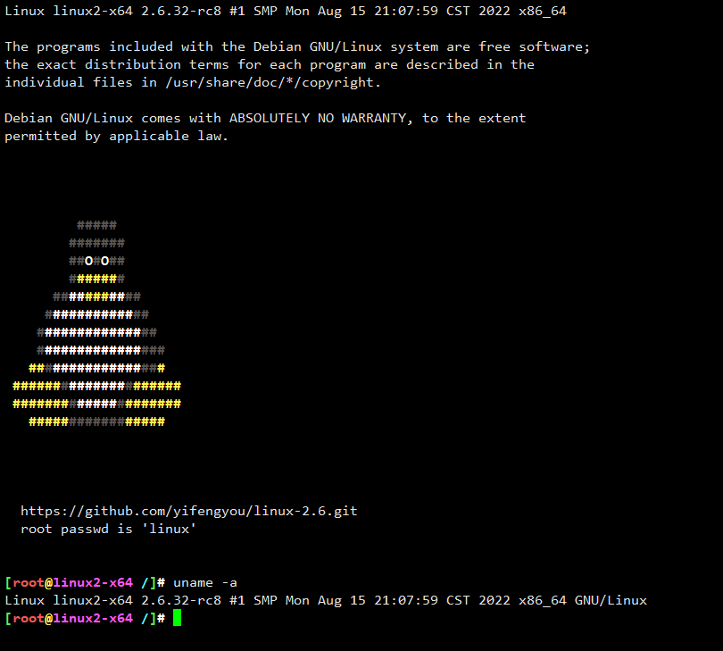

# Linux 2.6 内核学习笔记

```
Something I hope you know before go into the coding~
First, please watch or star this repo, I'll be more happy if you follow me.
Bug report, questions and discussion are welcome, you can post an issue or pull a request.
```


## 内核版本选择

```
commit 648f4e3e50c4793d9dbf9a09afa193631f76fa26 (HEAD, tag: v2.6.32-rc8)
Author: Linus Torvalds <torvalds@linux-foundation.org>
Date:   2009-11-20 06:32:38 (CST)

    Linux 2.6.32-rc8
```


## 目录

* [环境搭建](docs/环境搭建.md)
    * [版本选择](docs/环境搭建/版本选择.md)
    * [x86_64](docs/环境搭建/x86_64.md)
    * [编译适配](docs/环境搭建/编译适配.md)
    * [O0编译处理](docs/环境搭建/O0编译处理.md)
* [带着问题读内核](docs/带着问题读内核.md)


## 运行




## 图示


---
