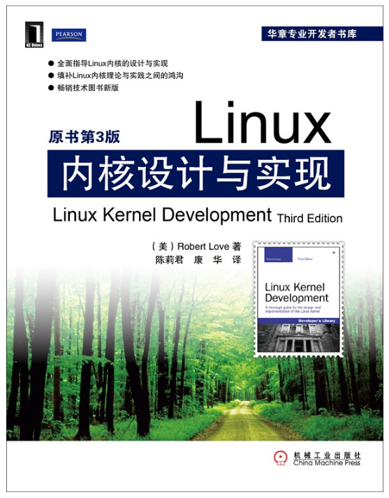

# Linux内核设计与实现

基于Linux 2.6.34内核详细介绍Linux内核系统，覆盖从核心内核系统的应用到内核设计与实现方面的内容。

* 无论读者开发内核是为了兴趣还是为了赚钱，作者都希望能够代理读者快速走进Linux内核世界。
* 阅读源代码远远不够，往往需要动手实践，寻找一个bug然后修复他它。增加新功能，看起来微不足道，寻找痛痒之处并解决带来的成就感将会是你在内核探索旅途上的精神养料。
* 总有一些原理是恒定不变的，不变应万变，中高考的时候老师经常讲，题目各种变，但无非就是辣些题型。
* 陈莉君老师搞得网站内核之旅，还有微信公众号，还有蓝墨云班课APP，有兴趣的了解一下。
* 有一点C语言基础，对Linux内核狂热，阅读本书足矣。
* 问：内核黑客怎么炼成？？

## 相关站点

Linux内核之旅:<http://www.kerneltravel.net/>

## END
