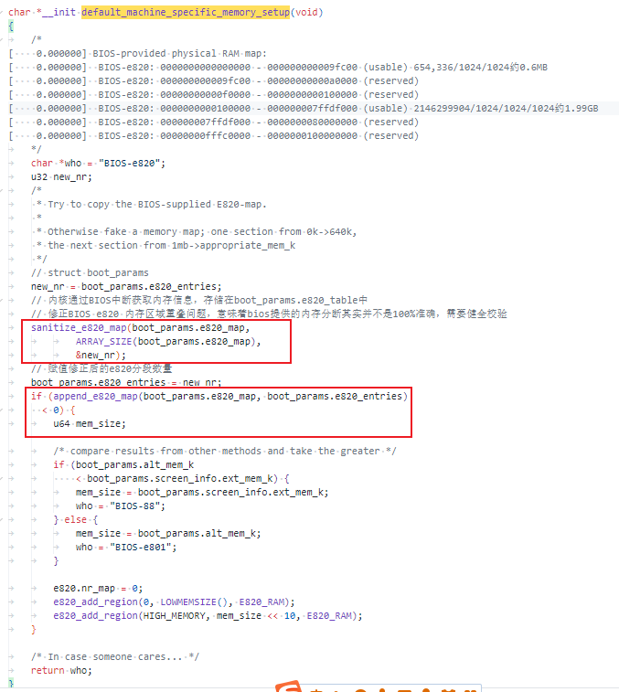
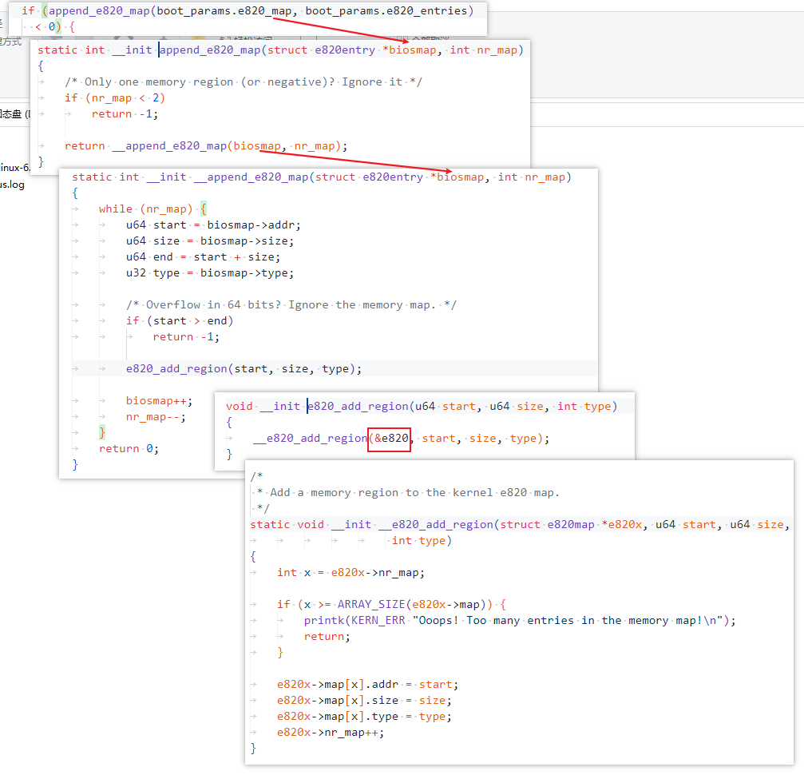
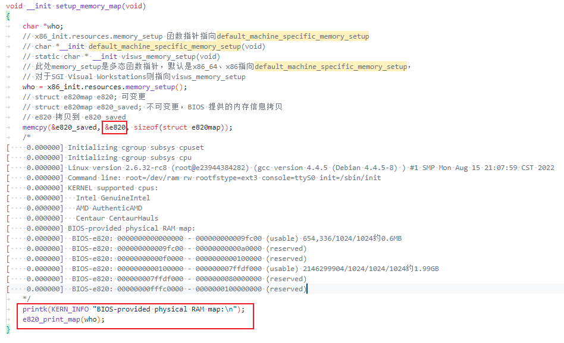
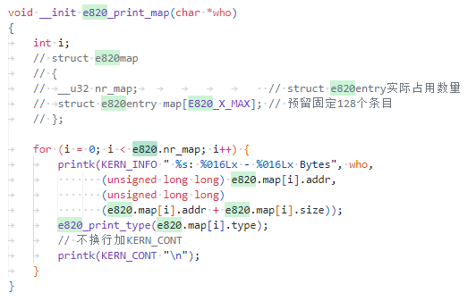
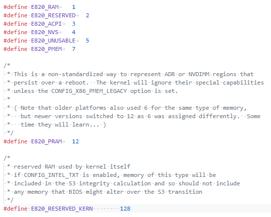
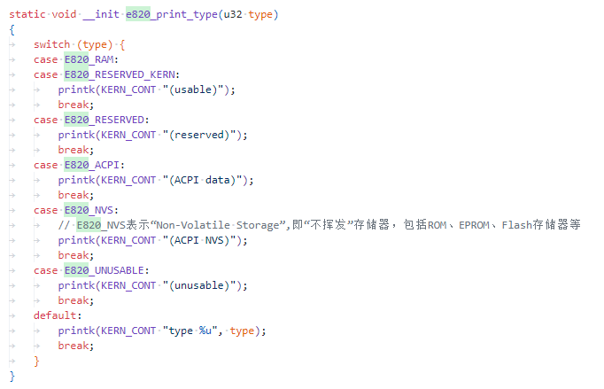

# x86架构内核如何通过e820获取内存布局

## 相关元数据

```
struct e820map e820;
struct e820map e820_saved;

struct boot_params {
  __u8  e820_entries;
  struct e820entry e820_map[E820MAX];		/* 0x2d0 */
  ...
}
```


## 控制流


* 调用bios中断获取e820数据放在 ```boot_params.e820_map```中


* 从boot_params.e820_table获取e820数据做健全校验，赋值给全局变量e820（可写），备份到e820_saved（不可写，原始数据备份）



数量与登记一致，长度也需要校验




* 内核启动过程中打印e820信息



此时内核都是用e820（```struct e820map e820;```）这个全局变量，打印e820信息（修正后的）



类型是个switch，值与type是e820约定好的






## 参考

* <https://www.yisu.com/zixun/524704.html>


---
