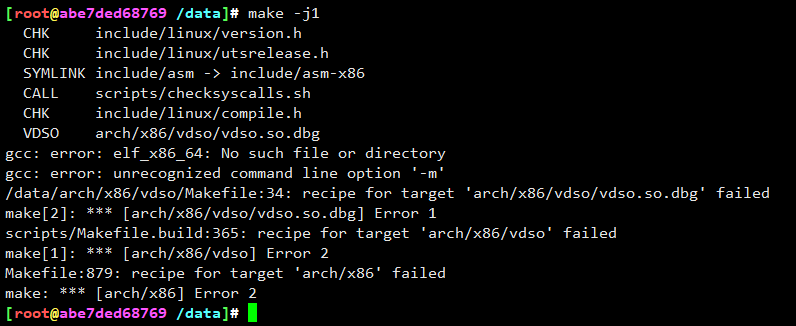
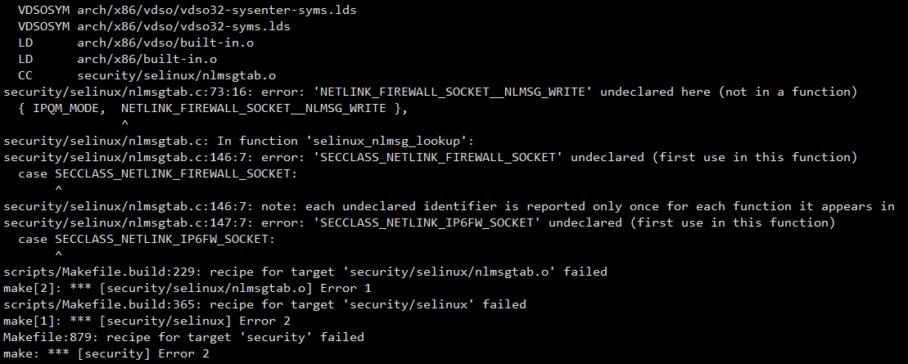
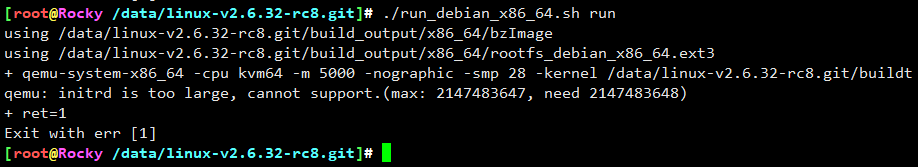
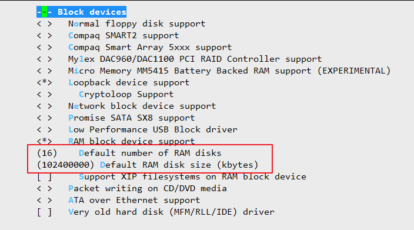

# 编译适配




```
sed -i 's/-m elf_x86_64/-m64/g' arch/x86/vdso/Makefile
sed -i 's/-m elf_i386/-m32/g' arch/x86/vdso/Makefile
```




头文件重复，移除```security/selinux```下的```flask.h```和```av_permissions.h```





修改支持的最大RAM盘


---
