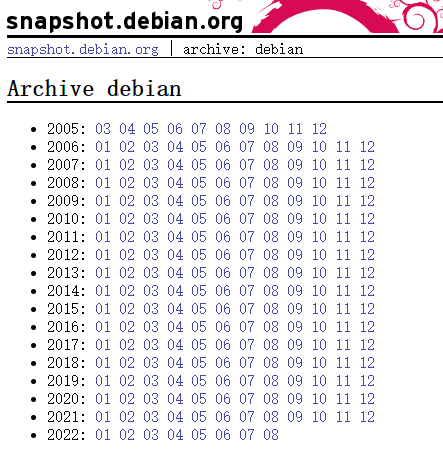
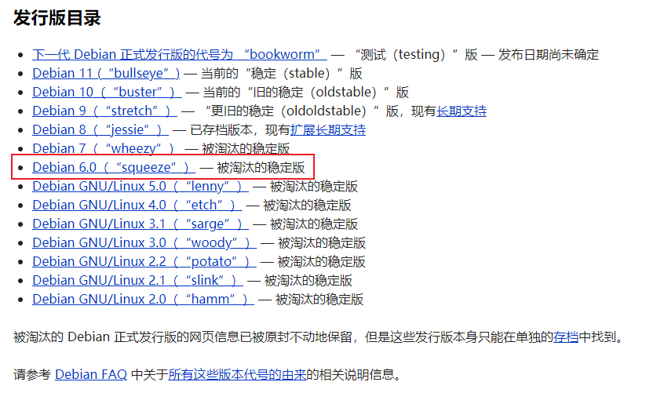
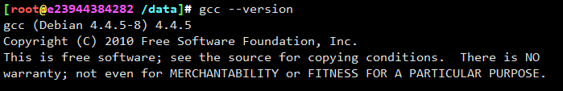

# 编译适配


## 发行版选择

纵观所有发行版，你不得不承认，debian的运营是最棒滴

当我看到snapshot的时候，震惊了，<https://snapshot.debian.org/> ，硬盘不要钱？居然可以获取到05年的完整镜像快照，

那红帽有没有？有，但是没那么容易get到。而debian，直接甩你一坨自取



通过不断回退版本，可以看到linux2.6系列内核，最初是在squeeze代号的debian发行版中使用




docker镜像获取，直接运行，正常，Dockerfile写起来，构造一个编译环境所需的镜像

```
FROM debian:squeeze

COPY bashrc /root/.bashrc
COPY sources.list /etc/apt/sources.list
RUN apt-get update && \
	apt-get install -y --force-yes vim gcc build-essential make \
		libncurses-dev \
		file git flex bison \
		bc libelf-dev libssl-dev && \
	rm -rf /etc/localtime && \
	ln -vfs /usr/share/zoneinfo/Asia/Shanghai /etc/localtime

```


```/etc/apt/sources.list``` 源修改成如下：

为什么不用牛批的snapshot，因为archive快十倍于英国牛津的snapshot镜像，不信你自己试试

```
deb [trusted=yes] http://archive.debian.org/debian-archive/debian squeeze main contrib non-free
deb-src [trusted=yes] http://archive.debian.org/debian-archive/debian squeeze main contrib non-free

deb [trusted=yes] http://archive.debian.org/debian-archive/debian squeeze-lts main contrib non-free
deb-src [trusted=yes] http://archive.debian.org/debian-archive/debian squeeze-lts main contrib non-free

deb [trusted=yes] http://archive.debian.org/debian-archive/debian squeeze-proposed-updates main contrib non-free
deb-src [trusted=yes] http://archive.debian.org/debian-archive/debian squeeze-proposed-updates main contrib non-free


deb [trusted=yes] http://archive.debian.org/debian-security/ squeeze/updates main contrib non-free
deb-src [trusted=yes] http://archive.debian.org/debian-security/ squeeze/updates main contrib non-free

```

构造linux 2.6 编译镜像

```
docker build . -t linux26-32:latest
```

创建docker daemon

```
#!/bin/bash

docker run -d --privileged \
	-v `pwd`:/data \
	-v /dev:/dev \
	--name v2.6.32-rc8 \
	linux26-32:latest /sbin/init
```

attach 到docker镜像

```
docker exec -it v2.6.32-rc8 /bin/bash -c "cd /data && bash"
```



gcc老古董版本，不过用起来ok


## 编译 linux2.6.32


```
sed -i 's/-m elf_x86_64/-m64/g' arch/x86/vdso/Makefile
sed -i 's/-m elf_i386/-m32/g' arch/x86/vdso/Makefile
```


头文件重复，移除```security/selinux```下的```flask.h```和```av_permissions.h```


修改支持的最大RAM盘


---
