# 第1章-Linux内核简介

## UNIX/Linux发家史

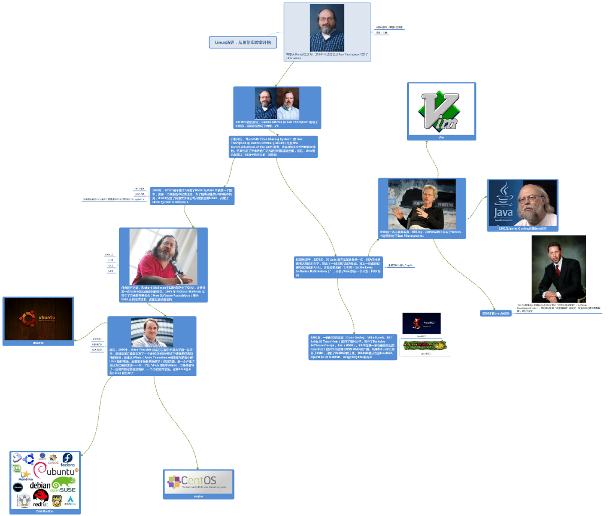

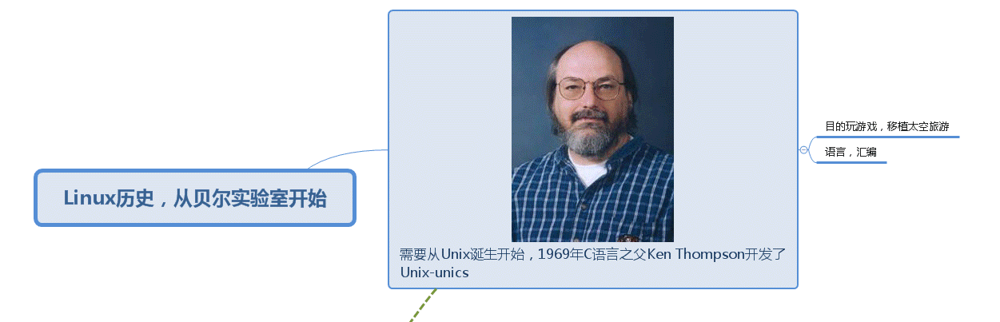

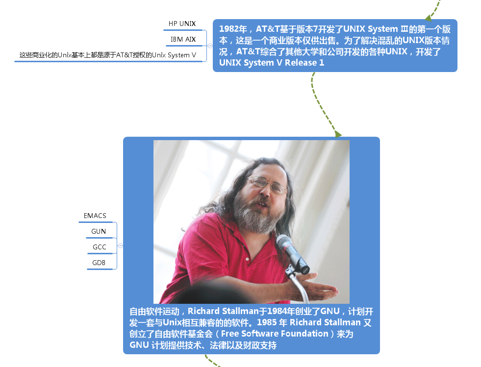

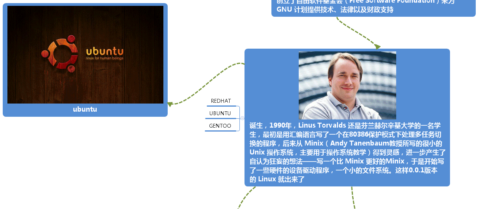

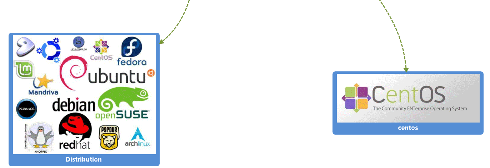

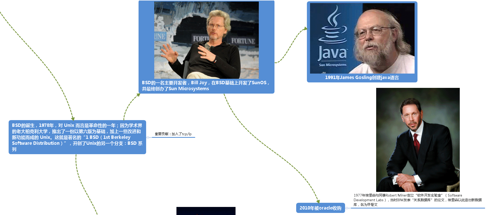

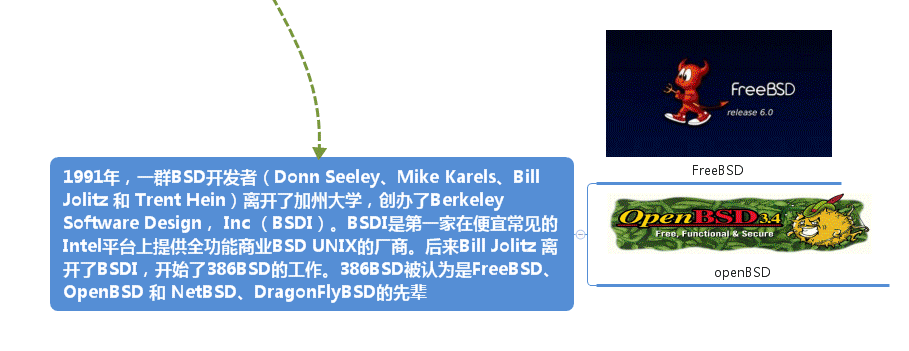

## 总结

* 内核 = 硬件管家 = OS核心
* 内核 = 中断处理 + 进程调度 + 内存管理 + 进程通信 + 网络 + 文件系统
* 普通程序 = 内核空间(限制访问) + 用户空间
* 内核程序 = 内核空间 + 可访问全部物理地址空间（间接操作）
* 应用程序调用库函数，库函数调用系统调用。应用程序也可以直接调用系统调用。基本就这两种内核交互方式。
* 通过系统调用，此时内核被称为“运行于进程上下文”，它其实调用的堆栈空间等等都是有进程PCB中的某些数据项决定。此时该进程还是运行态，只是出于内核态运行。
* 中断有独立的上下文环境，不对当前环境造成影响。因为当前被中断的进程，不管处于内核态还是用户态，进入中断前都要保存上下文，然后并不需要太多上下文变化就可以执行中断处理程序，因为它号称进程无关。只有进程才有完整的上下文环境，才有上下文依赖。

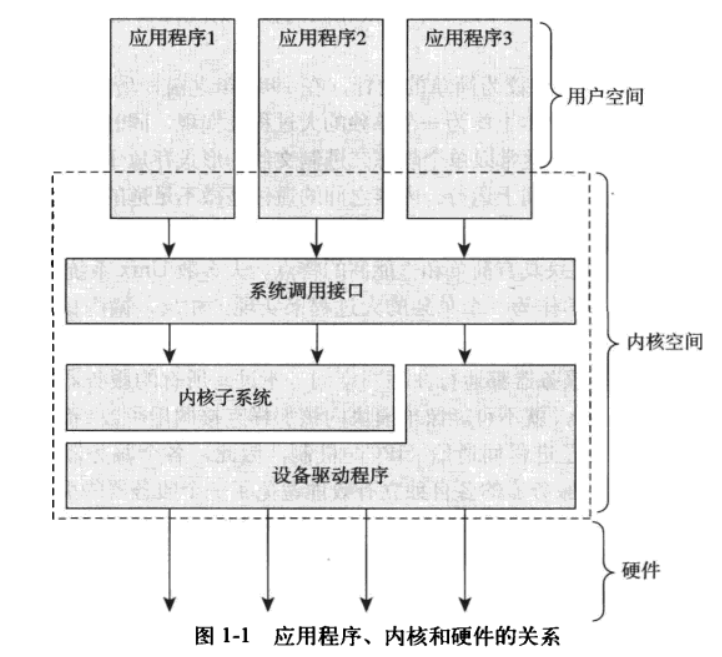

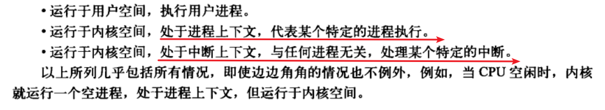

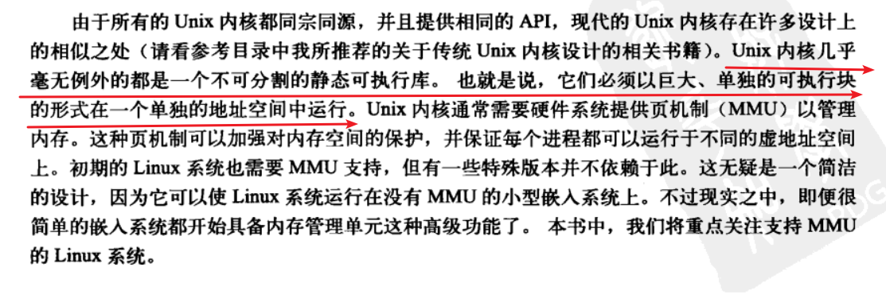

* Unix和Linux一样都是单内核的OS架构
* MMU是个硬件，需要软件辅助运行。
* 内核分为三种，单内核，微内核，外内核
* Linux显著特点

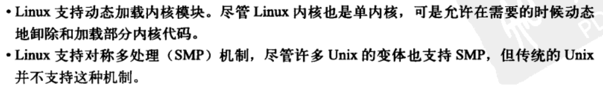

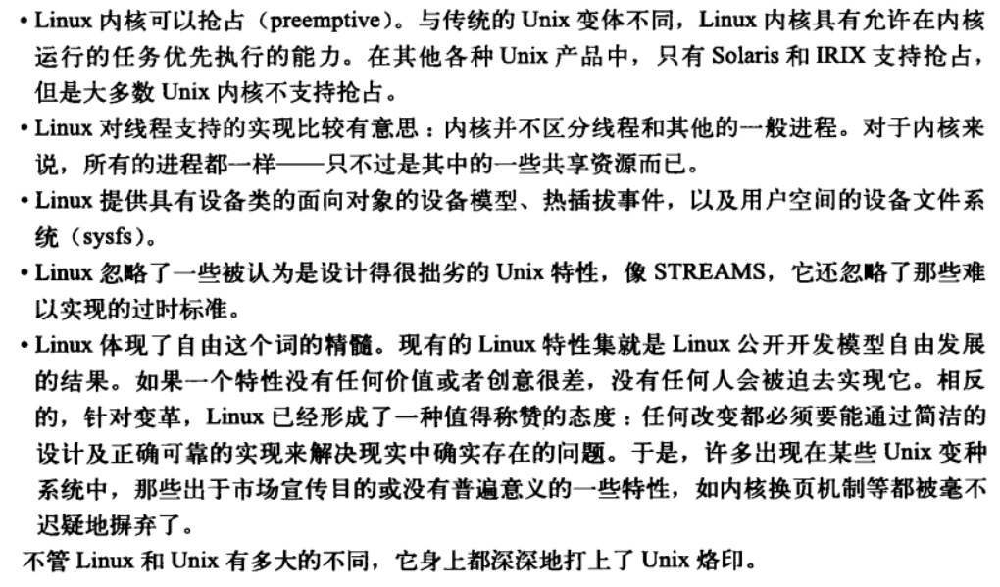

* 内核抢占，Unix绝大多数都没有。
* 不区分进程和线程
* 任何改变都要简洁，任何改变都要能解决某问题，提供某性能优化。
* 摒弃内核换页
* 神奇的LKML（Linux Kernel Mailing List），记得一定要加入~

## 参考

<http://blog.51cto.com/652465/2058189/>
